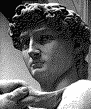
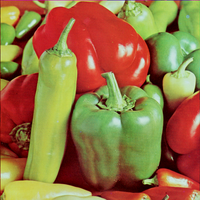
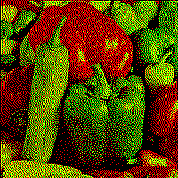

# dither

[](https://goreportcard.com/report/github.com/makeworld-the-better-one/dither)
[](https://pkg.go.dev/github.com/makeworld-the-better-one/dither/v2)

dither is a library for dithering images in Go. It has many dithering algorithms built-in, and allows you to specify your own. Correctness is a top priority, as well as performance. It is designed to work well on its own, but also implements interfaces from the standard library, so that it can be integrated easily in a wide variety of situtations.

This library is uniquely correct from a math and quality perspective. It linearizes the image, and color comparisons are done with human luminance perception in mind (channel weighting). Few-to-no other libraries do this.

It supports images that make use of the alpha channel, AKA transparency.

*Make sure to set your browser zoom to 100% to view these images properly*

| **Original** | **Dithering Algorithm** |
| :-: | :-: |
| | Floyd-Steinberg (black and white palette) |
| [](https://raw.githubusercontent.com/makeworld-the-better-one/dither/master/images/examples/david.png) | [](https://raw.githubusercontent.com/makeworld-the-better-one/dither/master/images/examples/floyd-steinberg_david.png) |
| | Floyd-Steinberg (red, green, yellow, black) |
| [](https://raw.githubusercontent.com/makeworld-the-better-one/dither/master/images/examples/peppers_small.png) | [](https://raw.githubusercontent.com/makeworld-the-better-one/dither/master/images/examples/floyd-steinberg_peppers.png)

## Types of dithering supported

- Random noise (in grayscale and RGB)
- **Ordered Dithering**
  - Bayer matrix of any size (as long as dimensions are powers of two)
  - Clustered-dot - many different preprogrammed matrices
  - Some unusual horizontal or vertical line matrices
  - Yours?
    - Using `PixelMapperFromMatrix`, this library can dither using any matrix
    - If you need more freedom, `PixelMapper` can be used to implement any method of dithering that affects each pixel individually
- **Error diffusion dithering**
  - Simple 2D
  - Floyd-Steinberg, False Floyd-Steinberg
  - Jarvis-Judice-Ninke
  - Atkinson
  - Stucki
  - Burkes
  - Sierra/Sierra3, Sierra2, Sierra2-4A/Sierra-Lite
  - [Steven Pigeon](https://hbfs.wordpress.com/2013/12/31/dithering/)
  - Yours? Custom error diffusion matrices can be used by the library.

More methods of dithering are being worked on, such as Riemersma, Yuliluoma, and blue noise.

## Install

In your project, run

```
go get github.com/makeworld-the-better-one/dither/v2@latest
```

You can import it as `"github.com/makeworld-the-better-one/dither/v2"` and use it as `dither`.

## Usage

Here's a simple example using Floyd-Steinberg dithering.

```go
img := // Get image.Image from somewhere

// These are the colors we want in our output image
palette := []color.Color{
    color.Black,
    color.White,
    // You can put any colors you want
}

// Create ditherer
d := dither.NewDitherer(palette)
d.Matrix = dither.FloydSteinberg

// Dither the image, attempting to modify the existing image
// If it can't then a dithered copy will be returned.
img = d.Dither(img)

// Now use img - save it as PNG, display it on the screen, etc
```

If you always want to dither a copy of the image, you can use `DitherCopy` instead.

Here's how you create a `Ditherer` that does Bayer dithering. Note how `d.Mapper` is used instead of `d.Matrix`.

```go
d := dither.NewDitherer(palette)
d.Mapper = dither.Bayer(8, 8, 1.0) // 8x8 Bayer matrix at 100% strength
```

Here's how you create a `Ditherer` that does clustered-dot dithering - dithering with a predefined matrix.

```go
d := dither.NewDitherer(palette)
d.Mapper = dither.PixelMapperFromMatrix(dither.ClusteredDotDiagonal8x8)
```

See the [docs](https://pkg.go.dev/github.com/makeworld-the-better-one/dither/v2) for more.


### More Examples

Sometimes you can't dither using the above code. These examples show how you can use this library in those situations.

- [Output to a static GIF](examples/gif_image/main.go)
- [Output to an animated GIF](examples/gif_animation/main.go)

If you're interested in what specific algorithms look like, you can check out the tests [output](images/output/) folder.

## Performance

Operations that only affect each pixel individually are parallelized, using `runtime.GOMAXPROCS(0)` which defaults to the number of CPUs. This applies to any `PixelMapper` (aka `Ditherer.Mapper`) but not to an `ErrorDiffusionMatrix` (aka `Ditherer.Matrix`), as the latter is inherently sequential.


## Scaling images

A dithered output image will only look right at 100% size. As you scale *down*, the image will immediately get darker, and strange grid-like artifacts will appear, known as a [moiré pattern](https://en.wikipedia.org/wiki/Moir%C3%A9_pattern). This is due to how dithered images work, and is not something this library can fix.

The best thing to do is to scale the *input* image to the *exact* size you want before using this library. But sometimes you want to scale the image up after dithering, to make the dithering effect more obvious for aesthetic purposes.

So for scaling the dithered output image *up* (above 100%), that will only look fine if you use **nearest-neighbor scaling** - the kind of scaling that produces pixelated results. Otherwise the dither pixel values will be blurred and averaged, which will mess things up. And even once you're using that, it will still produce moiré patterns, unless you're scaling by a multiple of the original dimensions. **So when scaling up, you should be scaling by 2x or 3x, rather than a non-integer like 1.34x.**

## Encoding output

Dithered images require that their pixel values be stored exactly. This means they must be encoded to a lossless format. PNG is almost always the best choice, as it is widely supported and takes up the least space. GIF is also acceptable, as long as the palette is 256 colors or less. The GIF format is also useful if you are dithering an animation. APNG is more efficient for animation, but has no Go stdlib support, and less support in non-browser environments.

The WebP format also works for both static images and animation, but it must be a lossless WebP, not a lossy one.

## What method should I use?

Generally, using Floyd-Steinberg serpentine dithering will produce the best results. The code would be:

```go
d := dither.NewDitherer(yourPalette)
d.Matrix = dither.FloydSteinberg
d.Serpentine = true
```

Playing with the strength of the matrix might also be useful. The example above is at full strength, but sometimes that's too noisy. The code for 80% strength looks like this:

```go
d.Matrix = dither.ErrorDiffusionStrength(dither.FloydSteinberg, 0.8)
```

The main reason for using any other dithering algorithm would be

- **Aesthetics** - dithering can be a cool image effect, and different methods will look different
- **Speed** - error diffusion dithering is sequential and therefore single-threaded. But ordered dithering, like using `Bayer`, will use all available CPUs, which is much faster.

## How do I get the palette?

Sometimes the palette isn't an option, as it might determined by the hardware. Many e-ink screens can only display black and white for example, and so your palette is chosen for you.

But in most cases you have all the colors available, and so you have to pick the ones that represent your image best. This is called [color quantization](https://en.wikipedia.org/wiki/Color_quantization).

I might end up writing another library that implements some common algorithms for this, like median cut. But there are some libraries that exist already. [joshdk/quantize](https://github.com/joshdk/quantize) looks like the best one, although there is also [this one](https://pkg.go.dev/github.com/soniakeys/quant/median).

## Tips

Some general tips for working with the library.

Any returned `PixelMappers` should be cached and re-used. There is no point in regenerating them, it just wastes resources.

If the palette is grayscale, the input image should be converted to grayscale first to get accurate results.

All the `[][]uint` matrices are supposed to be applied with `PixelMapperFromMatrix`.


## Images with transparency

Images with transparency are only supported in v2.2.0 and after.

This library does not dither in the alpha channel or support transparent palettes. Instead it just keeps track of the alpha channel, and the dithered image returned will always have the exact same alpha values for each pixel. This allows for dithering of images with transparent parts.

Dithering images with semi-transparent pixels will also work, but is not as useful, because the output image will *appear* to have colors that are not in the palette, due to whatever background image you use.


## Projects using `dither`

- [didder](https://github.com/makeworld-the-better-one/didder) - a powerful CLI dithering tool
- [wasm-palette-converter](https://github.com/CrispyBaguette/wasm-palette-converter) - dithering images to a color palette, in the browser
- Your project? Build something fun, show how cool dithering can be! Some ideas / things I'd love to see:
  - A client-side web app for general-purpose dithering using WASM
  - A GUI desktop application


## Similar libraries
- `image/draw` has a `draw.Drawer` called `FloydSteinberg`
- https://github.com/brouxco/dithering
- https://github.com/esimov/dithergo

The largest problem with all of these libraries is that they don't linearize the image colors before dithering, which produces incorrect results. They also only support error diffusion dithering.


## License

This library is under the Mozilla Public License 2.0. Similar to the LGPL, this means you can use this library in your project, even if it's proprietary. But any changes you make to the library's code must be released publicly. Crucially, this license allows for statically linking this library.

See [LICENSE](LICENSE) for details, and my [blog post](https://www.makeworld.space/2021/01/lgpl_go.html) on why you should use the MPL over the LGPL for Go code.
